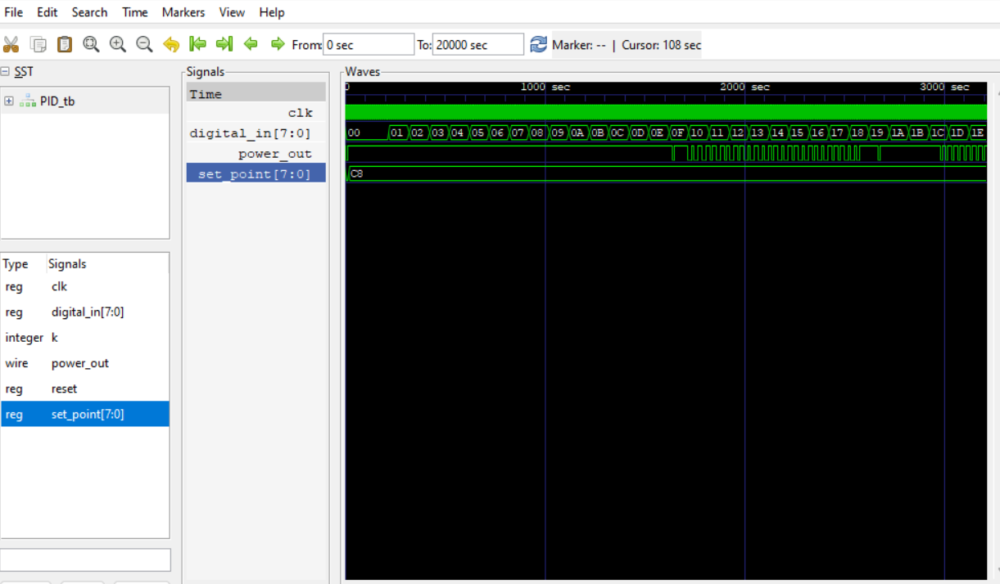

# PID Controller with PWM for Power Signal Generation (RTL Project)

This project implements a digital **Proportional-Integral-Derivative (PID) controller** with **Pulse Width Modulation (PWM)** output to control power signals, all written in **Verilog HDL**. The design targets applications like temperature, motor, or voltage control systems where closed-loop feedback is necessary.

## 🔧 Project Modules

### 1. `PID_Controller.v`
Implements the core PID control logic:

- **Inputs**: `in`, `set_point`, `clk`, `reset`
- **Output**: `out` (control signal)
- **Logic**:
  - Computes the error: `error = set_point - in`
  - Calculates `integral` (accumulated error), `derivative` (change in error)
  - Combines all three components using the gains `kp`, `ki`, and `kd`
  - Clamps output to prevent wind-up and overflow
  - Generates a signed 10-bit control signal

### 2. `PWM.v`
Generates a PWM waveform based on the signed PID control signal.

- **Inputs**: `clk`, `reset`, `control_signal`
- **Output**: `out` (PWM signal)
- **Logic**:
  - A 10-bit up-counter defines the PWM time base.
  - A duty cycle is calculated by offsetting 50% (1024) with the control signal.
  - If `control_signal = 0`, duty cycle = 50%.
  - The duty cycle increases or decreases based on error.

### 3. `PID_top.v`
Top-level module connecting `PID_Controller` and `PWM`.

- Accepts a separate `clk` for PID computation and `pwm_clk` for high-resolution PWM generation.
- Routes `digital_in` and `set_point` to the PID controller.
- Connects PID output directly to PWM control input.

### 4. `tb_PID_top.v`
Testbench to validate the design.

- Generates both slow (`clk`) and fast (`pwm_clk`) clocks.
- Provides multiple test cases with varying set points and input values.
- Dumps waveform to a `.vcd` file and prints signal values to console.

## ⚙️ Working Principle

- The system continuously computes the **error** between the desired value (`set_point`) and the actual input (`digital_in`).
- Based on this error, the PID controller adjusts the **control signal**.
- The PWM module then translates this control signal into a **power output waveform** with variable duty cycle.
- A **higher duty cycle** implies more power delivery (if `set_point > input`), and vice versa.

## 🧪 Simulation and Waveform

To simulate:
```bash
iverilog -o pid_tb tb_PID_top.v PID_top.v PID_Controller.v PWM.v
vvp pid_tb
gtkwave waveform_PID.vcd
```

### 🔍 Output Waveform

Below is an example output waveform of the simulation, showing how the PWM output adapts based on the error.

> 

> 📌 _Make sure the image file `pid_waveform.png` is placed in a folder named `/images/` inside your GitHub repo._

## 📁 File Structure

```
├── PID_Controller.v
├── PWM.v
├── PID_top.v
├── tb_PID_top.v
├── waveform_PID.vcd
├── images/
│   └── pid_waveform.png
└── README.md
```

## ✅ Features

- Fully synthesizable Verilog code.
- Simulatable testbench with wave dumping.
- Clamped integrator to prevent wind-up.
- Parameterized PID coefficients.
- Clean separation between control and actuation.

## 🧠 Future Enhancements

- Add real ADC/DAC interfaces for analog signal integration.
- Auto-tuning PID coefficients (e.g., Ziegler-Nichols method).
- Extend to multi-variable or cascaded control systems.
- Implement on FPGA for real-time control.

## 👨‍💻 Author

**Keshav Balakrishnan**  
Electronics and Communication Engineer  
LinkedIn: [https://www.linkedin.com/in/keshav-balakrishnan/]

## 📜 License

This project is licensed under the MIT License. See `LICENSE` for details.
